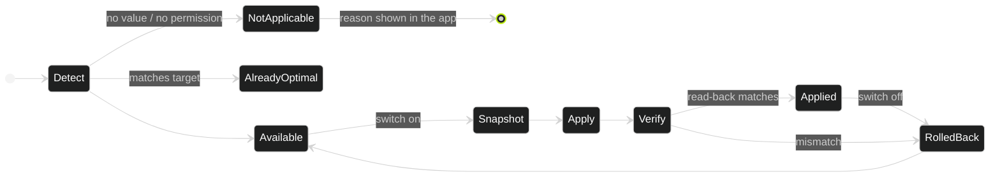
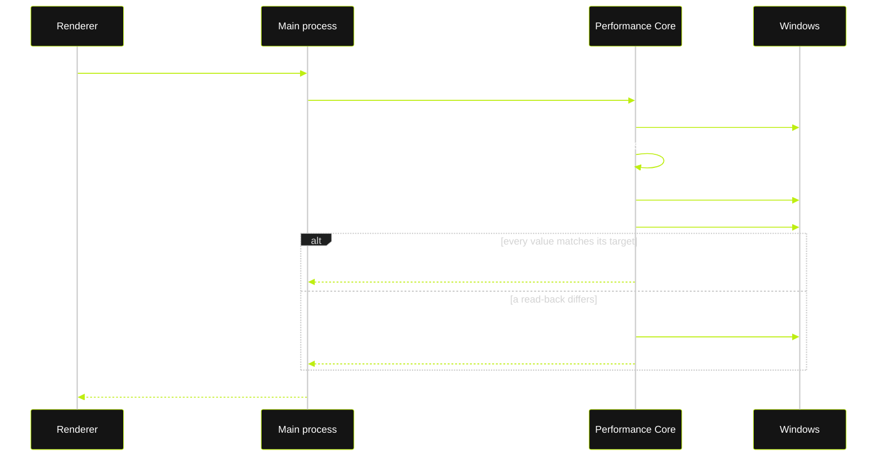

  

  
  
  
  
  
  
  

<h3 align="center">Measurable. Reversible. Verified.</h3>

NEXUS is a game performance engine for Windows. It reads your hardware and your games, applies optimizations whose effect can be measured, backs every change up before it touches anything, and proves the result with real frame-time benchmarks. 
<b>No placebo tweaks. No FPS promises. Your numbers, on your PC.</b>

 

## What a boost is

A boost is a switch. Behind every switch: the real current value of the setting, the value NEXUS wants, why that helps, when it won't, and the risk level. Switching it off restores exactly what was there before. A boost that cannot apply on your system says why instead of hiding.

## How a boost runs

Every switch runs the same transaction. The original value is snapshotted to disk before the first write, the change is verified by reading it back from Windows, and a failed verification rolls the change back on the spot. Multi-step sets unwind in reverse order on the first failure: nothing is ever left half-applied.

## Architecture

The interface never touches Windows. The renderer is sandboxed with no Node and no shell; it talks to the Electron main process over a typed, exhaustively validated IPC contract; the main process talks to a separate .NET 8 process, the Performance Core, over newline-delimited JSON on stdio. Only the core reads or writes the machine.

## Benchmarks

FPS claims are easy to make and hard to measure honestly. NEXUS records frame times straight from the graphics kernel (an ETW session on `Microsoft-Windows-DxgKrnl`) while the game runs, counts each frame exactly once, and derives every number from those frame times: time-weighted average, 1% and 0.1% lows by the percentile method, p95 / p99 frame time as the render-latency floor. Too few samples for a statistic? It is withheld, not estimated.

## Safety model

## Stack

| Layer | Technology | Role |
| --- | --- | --- |
| Desktop | Electron · React 19 · TypeScript · Tailwind · Zustand · Framer Motion | Launcher-style UI, per-game workspace, overlay HUD |
| Contracts | Shared TypeScript types · zod schemas | One typed IPC surface, validated on both ends |
| Performance Core | .NET 8 (self-contained, win-x64) · WMI · performance counters · ETW · P/Invoke | Hardware scan, optimizations, snapshots, benchmarks, telemetry |
| Server | Fastify 5 · SQLite · scrypt · rotating refresh tokens | Accounts, admin panel, changelog, release feed |
| Delivery | NEXUS installs, patches and uninstalls itself | Own setup UI; updates download in the background, verify SHA-512, apply on restart |

## Principles

1. **If it cannot be measured, it does not ship.**
2. **If it cannot be reversed, it does not ship.**
3. **Say why something is unavailable** instead of hiding it.
4. **Never touch the game process.** Overlay and capture stay outside it.

Fortnite is supported today. More titles follow the same rules.

